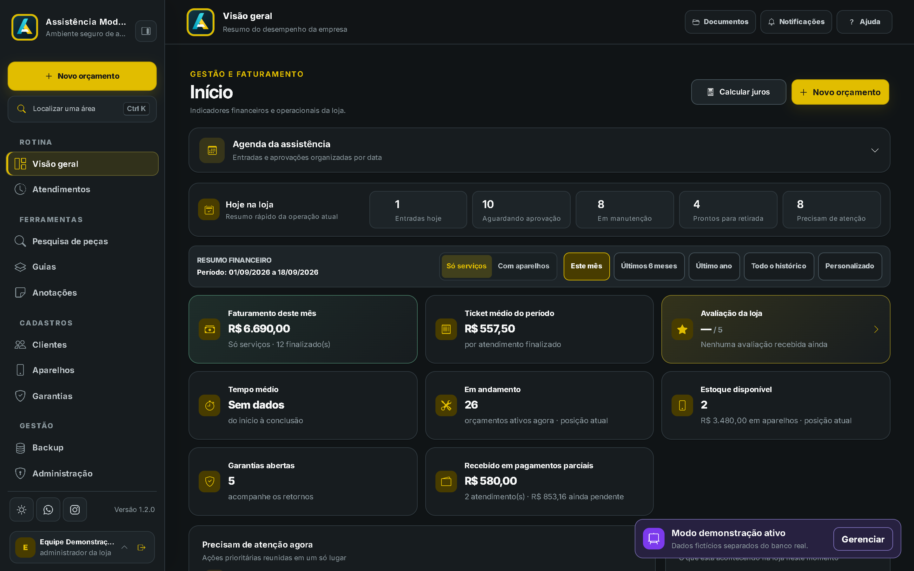
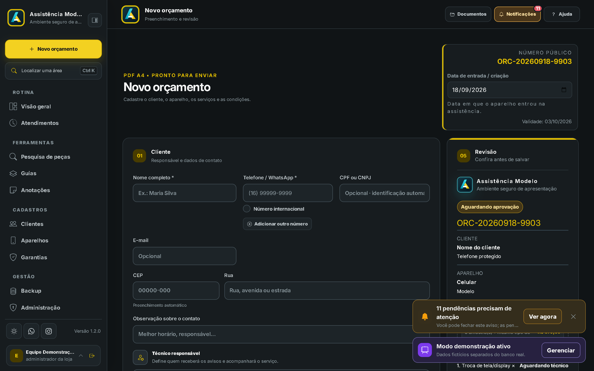
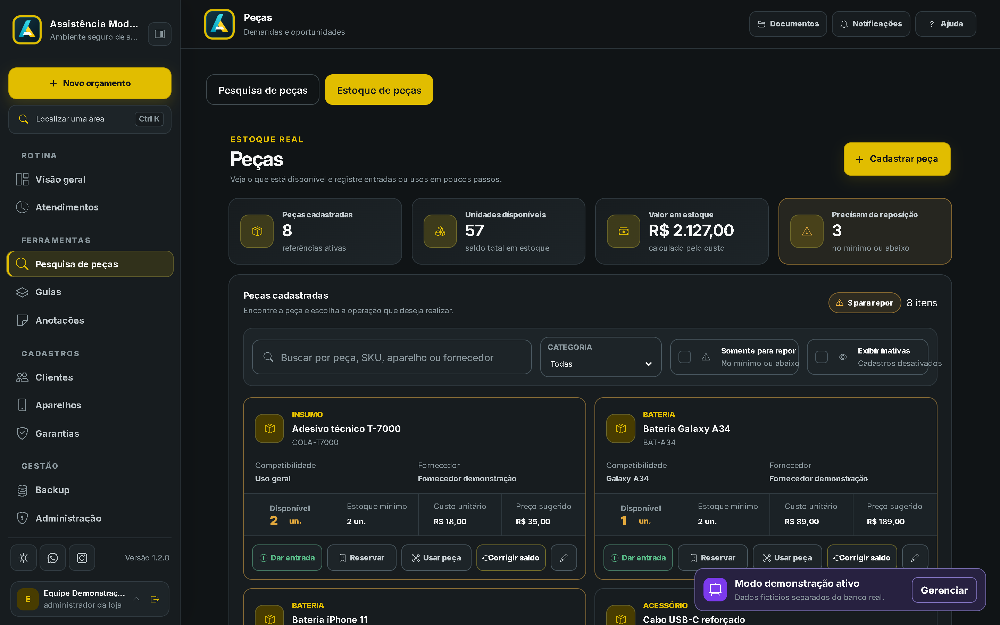

# Manual do aplicativo — Assistência Simplificada

> Manual operacional atualizado para a linha atual do aplicativo Windows. Veja também as [releases oficiais](../../releases/latest).

As imagens abaixo foram feitas com a versão **1.2.0** e dados fictícios.

## 1. Primeiro acesso

1. Instale a versão baixada nas releases oficiais em um computador com Windows 10 ou 11 de 64 bits.
2. Informe a chave de ativação e conclua a primeira confirmação online.
3. Crie a conta administradora da loja e depois contas individuais para a equipe.
4. Cadastre os dados da assistência, preferências de documentos e pasta de PDFs.

A senha é solicitada no login. As ações internas usam confirmações visuais quando necessário; não exigem repetir a senha a cada alteração.

## 2. Orçamentos e atendimentos

Em **Atendimentos**, registre o cliente, aparelho, defeito, serviços, prazo e condição de pagamento. O status padrão de serviço é **Reparo com peça**. Mensagens salvas em cada status podem ser reutilizadas, sem alterar o padrão dos próximos orçamentos.

Quando existirem opções para o mesmo serviço, cadastre cada alternativa e indique a escolhida. Na aprovação, o atendimento mostra a opção aprovada com ✓ e as demais com ✕. O PDF também deixa essa decisão visível.

Use **Revisar orçamento** quando surgir um novo defeito durante a manutenção. O orçamento anterior fica preservado no histórico e a revisão passa a ser a proposta em aberto.

Em serviços cancelados sem cobrança, a retirada pode ser registrada sem exigir que formas de pagamento somem um valor inexistente.

## 3. Estoque de peças

Abra **Procurar peças → Estoque** para cadastrar telas, baterias, conectores e outros itens. Informe aparelho compatível, descrição, custo, preço sugerido e quantidade.

- O estoque é um apoio: é possível criar e concluir orçamento mesmo sem peça cadastrada.
- Ao incluir um serviço compatível, o orçamento informa que há uma peça disponível.
- A peça escolhida é reservada ao salvar o orçamento. A baixa ocorre quando a manutenção começa.
- Se um orçamento que entrou em manutenção for cancelado, a peça pode ser reposta porque não foi instalada.
- Vendas de aparelhos usados não são classificadas como venda sob encomenda.

## 4. Agenda, anotações e lembretes

A agenda destaca somente datas de **aprovação**, **entrega** e anotações vinculadas. Para criar uma anotação, escolha o dia, escreva o lembrete e, se desejar, vincule-o a um atendimento.

Os lembretes aparecem no canto inferior direito, como os avisos de aprovação do cliente. Lembretes, respostas de técnico e outras notificações que exigem atenção podem emitir som. Ao selecionar uma notificação, o aplicativo abre o atendimento, anotação ou peça relacionada.

## 5. Links para cliente e técnico

Cada atendimento pode ter um link individual para o cliente acompanhar as etapas, consultar informações e enviar uma avaliação após a retirada. O acesso pede os últimos quatro dígitos do telefone cadastrado, com uma mensagem explicando claramente essa validação.

Fotos acrescentadas depois da criação do atendimento, inclusive após a entrega, são incluídas na atualização do link. O técnico recebe um convite temporário para informar diagnóstico e valores; o responsável pela loja decide se aplica a resposta.

O modo claro dos links foi revisado para manter contraste e leitura em celulares.

## 6. Avaliações

Ao finalizar o atendimento, a mensagem de entrega pode direcionar o cliente para a avaliação. A página permite selecionar pontos positivos, escrever uma observação e atribuir estrelas.

A loja vê a média e as avaliações recentes no aplicativo. O envio passa pela nuvem somente para alcançar a assistência; o registro é mantido localmente na base da loja.

## 7. Vitrine virtual

Na Vitrine, cadastre aparelhos disponíveis, venda por encomenda e preços. Os clientes podem filtrar por memória interna e RAM. A mensagem PayJoy pode ser ativada ou desativada conforme o uso da loja.

O link de edição de preços permite copiar de uma vez o nome de todos os aparelhos publicados para enviar ao fornecedor.

## 8. Backup e restauração

Use **Administração → Backup** para gerar uma cópia do banco, links, orçamentos e configurações disponíveis no aplicativo. Salve também uma cópia fora do computador principal.

Para restaurar, abra a mesma central, escolha o arquivo de backup e confira a prévia antes de confirmar. A restauração substitui os dados operacionais atuais; faça um backup novo antes de restaurar outro arquivo.

## 9. Licença e dados

A ativação inicial exige internet. Depois disso, o aplicativo pode funcionar offline por até **2 dias** dentro de uma licença válida. A conexão periódica confirma a licença; manter a internet ligada apenas para reiniciar o prazo não substitui essa validação.

Quando uma licença comum vence, os dados da loja entram em retenção para recuperação por **7 dias**. Em licença de teste, a exclusão ocorre **2 dias** após o fim do teste. Faça backup antes do vencimento se precisar guardar os dados fora do período de retenção.

## 10. Atualizações oficiais

Use apenas as releases deste repositório ou o botão do aplicativo. Cada pacote oficial inclui validações de integridade. A versão atual é `1.2.0`; a sequência estável segue até `1.9.0` e depois `2.0.0`. Versões estáveis não usam correção diferente de zero. Quem usa uma versão antiga da série 9.x deve baixar e instalar a nova série 1.x pelo site oficial.

## Boas práticas

- Use contas individuais e não compartilhe senhas.
- Revise destinatário e texto antes de confirmar mensagens no WhatsApp.
- Não envie backups, bancos, documentos ou chaves de ativação pelo suporte.
- Mantenha cópias externas de backup e teste a restauração periodicamente.
- Instale somente atualizações publicadas nas releases oficiais.
