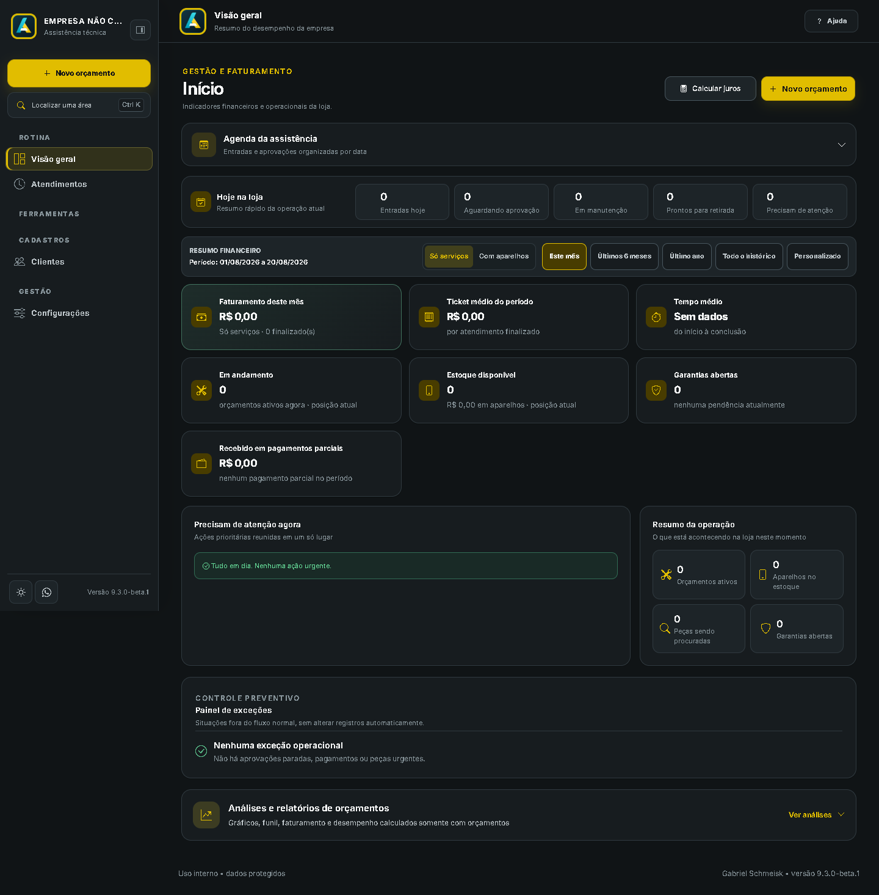

# Assistência Simplificada — Atualizações oficiais

  

<strong>O aplicativo Windows para organizar atendimentos, aparelhos, peças e a operação da assistência em um só lugar.</strong>

  <a href="https://assistenciasimplificada.site"><strong>Conhecer o site</strong></a> ·
  <a href="MANUAL-APLICATIVO.md"><strong>Abrir manual</strong></a> ·
  <a href="../../releases/latest"><strong>Baixar versão atual</strong></a>

> Este é o canal público de distribuição. Ele contém apenas instaladores oficiais, notas de versão, o manual e imagens de referência. O código-fonte do aplicativo permanece em repositórios privados.

## O que o aplicativo resolve

| Atendimento | Gestão da loja | Comunicação e segurança |
| --- | --- | --- |
| Orçamentos, ordens de serviço, aprovação, revisão, manutenção e retirada. | Peças em estoque, vitrine, vendas, agenda, relatórios, backup e restauração. | Links individuais para cliente e técnico, licenças, permissões por usuário e dados locais protegidos. |

## Funcionalidades atuais

- **Orçamentos completos:** cliente, aparelho, serviços, alternativas de peça, desconto, entrada, técnico, prazo, status e histórico.
- **Aprovação clara:** serviços e peças aprovados ficam identificados no atendimento e nos documentos.
- **Estoque de peças opcional:** cadastre telas, baterias e demais itens; o orçamento informa a disponibilidade e baixa a peça somente quando o serviço é concluído. Um cancelamento após o início da manutenção pode repor a peça.
- **Vitrine e vendas:** catálogo de aparelhos, filtros de memória/RAM, itens à pronta entrega ou sob encomenda e compartilhamento de preços.
- **Agenda e lembretes:** datas de aprovação, entrega e anotações vinculadas; avisos podem abrir diretamente o assunto relacionado.
- **Links de atendimento:** cliente acompanha o serviço e avalia o atendimento; o técnico recebe convite temporário para diagnóstico e resposta.
- **Avaliações da loja:** nota média e últimas avaliações ficam no aplicativo da loja.
- **Documentos e backup:** PDFs de orçamento, retirada e ordem de serviço; cópia e restauração dos dados pelo próprio aplicativo.
- **Licença e proteção:** dados preservados localmente, funcionamento offline limitado e validações de atualização assinada.

## Comece por aqui

1. Baixe somente pela [release mais recente](../../releases/latest).
2. Instale no Windows 10 ou 11 de 64 bits.
3. Ative a licença com a chave recebida e conclua o cadastro da loja.
4. Leia o [manual atualizado](MANUAL-APLICATIVO.md) antes de usar as funções de estoque, backup, links e licença.

## Versão atual

A release atual é a **1.1.0**. As próximas versões seguem `1.2.0` até `1.9.0`; depois seguem para `2.0.0`. Cada release estável usa o formato `MAIOR.MENOR.0`.

## Suporte e links

- Site oficial: [assistenciasimplificada.site](https://assistenciasimplificada.site)
- Guia e dúvidas: [Central de ajuda](https://assistenciasimplificada.site/guia)
- Atualizações: [Releases oficiais](../../releases)

## Segurança da distribuição

Antes de instalar, confira se o arquivo foi baixado desta página de releases. Cada publicação inclui o instalador, manifesto de atualização assinado e hashes de verificação. Nunca publique nem envie backups, bancos de dados, chaves de ativação ou senhas neste repositório.

